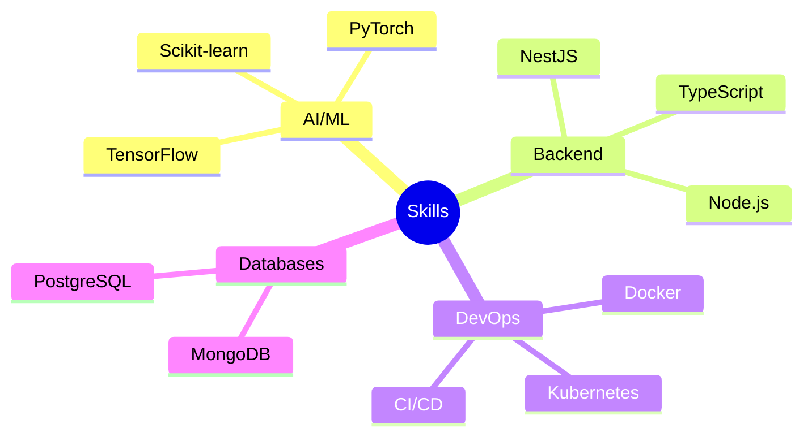

<p align="center">
  
</p>

## 🔭 About Me
```Hello World! I'm passionate about AI and Backend Development```


### 🛠️ Tech Stack & Tools
<p align="left">
  
  
  
  
</p>

### 📊 GitHub Analytics
<p align="center"> 
  
  
</p>

### 🎯 Expertise


📈 Contribution Graph


🤝 Connect With Me
<p align="center"> <a href="https://linkedin.com/in/vhung2010">  </a> <a href="mailto:viethung20101@gmail.com">  </a> </p>
<p align="center">  </p>
